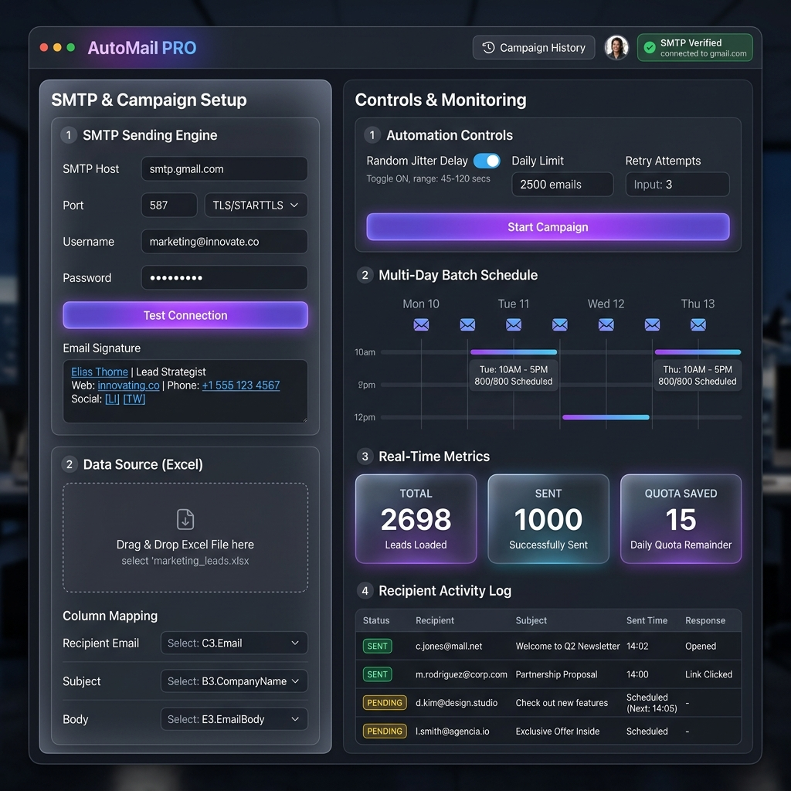

# 📧 AutoMail Pro - Bulk Email Dispatcher
> **Made with ❤️ by Hitesh Bohra**

[](https://electronjs.org/)
[](https://nodejs.org/)
[](https://nodemailer.com/)
[](https://sheetjs.com/)
[](https://opensource.org/licenses/ISC)

**AutoMail Pro** is a sleek, modern desktop application built with **Electron**, **Nodemailer**, and **SheetJS (XLSX)** that automates sending personalized bulk emails, CC/BCC recipients, and attachments directly from your Excel (`.xlsx`, `.xls`) or CSV files. Created by **Hitesh Bohra**.

---

## 🖼️ Application Preview



---

## ✨ Features

- 📄 **Universal Spreadsheet Support**: Read and process `.xlsx`, `.xls`, and `.csv` files seamlessly.
- ⚡ **Auto & Custom Column Mapping**: Automatic smart column detection with full manual override mapping for `Email Address`, `Subject / Topic`, `Email Body`, and `Attachment Path`.
- 👥 **Multi-Recipient Support**: Send emails to multiple recipients per row (separated by commas `,` or semicolons `;`).
- ⚡ **Quick SMTP Presets**: Pre-configured SMTP settings for **Gmail / Google Workspace**, **Outlook / Office 365**, **Yahoo Mail**, or **Custom SMTP Servers**.
- 🧪 **Live Connection Test**: Verify SMTP host, port, and authentication credentials before launching campaigns.
- 📎 **Personalized Dynamic Attachments**: Attach custom files per row by specifying local file paths in your Excel sheet.
- ⏱️ **Rate Limit & Anti-Spam Controls**: Customizable inter-email delay (milliseconds) to respect mail server throttling limits and avoid spam flags.
- 📊 **Real-Time Progress Tracking**: Live status monitor showing total contacts, sent/failed counts, progress bar, and real-time execution logs.
- 📁 **Campaign Execution Export**: Export detailed execution reports (status, response, timestamp, error logs) back into an Excel (`.xlsx`) or `.csv` file.
- 🧪 **Sample Data Generator**: Includes a built-in helper script (`create_sample_excel.js`) to generate sample test data instantly.

---

## 🛠️ Prerequisites

Before running the application, make sure you have the following installed:

- **Node.js**: `v18.0.0` or higher ([Download Node.js](https://nodejs.org/))
- **npm**: `v9.0.0` or higher (comes bundled with Node.js)
- **Git**: ([Download Git](https://git-scm.com/))

---

## 🚀 Quick Start Guide

### 1. Clone the Repository

```bash
git clone https://github.com/nhiteshbohra/bulkmail.git
cd bulkmail
```

### 2. Install Dependencies

```bash
npm install
```

### 3. Generate Sample Excel File (Optional)

To test the application immediately with sample data, run:

```bash
node create_sample_excel.js
```

This creates a `sample_contacts.xlsx` file in the project folder with pre-filled test columns.

### 4. Launch the Application

```bash
npm start
```

---

## 📋 Excel / CSV Format Guide

AutoMail Excel can automatically detect your sheet headers, or you can map any column names manually in the UI.

### Recommended Column Structure

| EMAIL ADDRESS | TOPIC | BODY | ATTACHMENT PATH |
| :--- | :--- | :--- | :--- |
| `john.doe@example.com, tech@example.com` | `Monthly Performance Update` | `Dear John,\n\nPlease see attached report.` | `C:\Documents\Report.pdf` |
| `alice.smith@example.com` | `Welcome to the Team!` | `Hello Alice,\n\nWelcome aboard!` | `C:\Documents\Onboarding.pdf` |

> 💡 **Tips:**
> - Multiple email addresses in one cell can be separated with commas (`,`) or semicolons (`;`).
> - The `ATTACHMENT PATH` field is optional. Leave it empty if no attachment is required for that row.
> - Plain text line breaks (`\n`) will be automatically formatted for email rendering.

---

## ⚙️ SMTP Setup Instructions

### 1. Gmail / Google Workspace Setup
- **Host**: `smtp.gmail.com`
- **Port**: `587` (TLS) or `465` (SSL)
- **User**: Your Gmail address (`your.email@gmail.com`)
- **Password**: **Google App Password** *(Required if 2-Factor Authentication is enabled)*.
  > 🔑 **How to get a Gmail App Password:**
  > 1. Go to your [Google Account Security Settings](https://myaccount.google.com/security).
  > 2. Enable **2-Step Verification**.
  > 3. Search for **App Passwords** in the search bar.
  > 4. Create an App Password for **Mail** and copy the 16-character password into the app.

### 2. Outlook / Office 365 Setup
- **Host**: `smtp.office365.com`
- **Port**: `587`
- **User**: Your Outlook email address
- **Password**: Your account password or App Password

### 3. Custom SMTP
- Enter your SMTP server details, port, username, password, and SSL/TLS toggles as provided by your email service provider or hosting administrator.

---

## 📁 Project Structure

```text
bulkmail/
├── main.js                  # Electron main process (IPC handlers, file parsing, SMTP engine)
├── preload.js               # Context bridge exposure for secure IPC communication
├── create_sample_excel.js   # Helper script to generate sample Excel contacts
├── package.json             # App metadata, dependencies, and npm scripts
├── .gitignore               # Git ignore rules
└── src/
    ├── index.html           # Desktop UI structure & dynamic forms
    └── styles.css           # Glassmorphism dark mode UI styling
```

---

## 🛠️ Built With

- **[Electron](https://electronjs.org/)** - Desktop GUI Framework
- **[Node.js](https://nodejs.org/)** - JavaScript Runtime Environment
- **[Nodemailer](https://nodemailer.com/)** - SMTP Mail Dispatcher
- **[SheetJS / XLSX](https://sheetjs.com/)** - Excel & CSV Parser

---

## ❓ FAQ & Troubleshooting

<details>
<summary><b>1. Error: 535 5.7.8 Error: authentication failed</b></summary>
<br>
This happens when using a normal account password instead of an <b>App Password</b> (especially for Gmail and Yahoo). Please follow the Google App Password instructions above to generate a 16-digit passcode.
</details>

<details>
<summary><b>2. Attachment file not found error</b></summary>
<br>
Make sure the full path specified in your Excel sheet exists on your computer (e.g. <code>C:\Users\Name\Documents\file.pdf</code>).
</details>

<details>
<summary><b>3. Is my email password stored anywhere?</b></summary>
<br>
<b>No.</b> Credentials are only kept in application memory for the duration of the current session and sent directly to your configured SMTP server over secure sockets.
</details>

---

## 📜 License

This project is licensed under the [ISC License](LICENSE).

---

## 👤 Author

Developed by **[Hitesh Bohra](https://github.com/nhiteshbohra)**.

Feel free to ⭐ **Star** this repository if you find it helpful!
